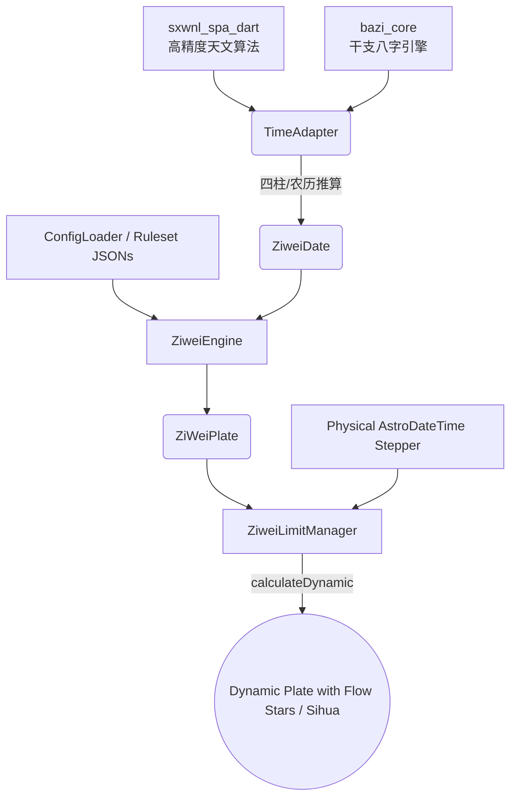

# 🔮 Ziwei Core

[](https://pub.dev/packages/ziwei_core)
[](https://pub.dev/packages/ziwei_core)
[](https://opensource.org/licenses/MIT)

Ziwei Core 是一款支持 6000 年超长时空跨度（约$-1000$ 至 $5000$）的配置驱动型紫微斗数排盘引擎。目前首发于 Dart/Flutter 生态，其核心采用了依赖注入（DI）架构，实现了算法与数据的深度解耦。支持“内存常量”与“动态 JSON”双轨加载，旨在为全平台提供一套极速、无状态、且高度可扩展的排盘算力底层。

本项目使用[bazi_core(dart)](https://github.com/RedSC1/bazi_core)计算节气四柱、获取农历时间，[sxwnl_spa_dart](https://github.com/RedSC1/sxwnl_spa_dart)计算节气、真太阳时等。排盘时间经测试可以支持公元前约1000年到公元5000年，更早以及更远的时间理论上也可以计算，但是精度无法保证，具体精度受到[sxwnl_spa_dart](https://github.com/RedSC1/sxwnl_spa_dart)的限制。

---

## ✨ 核心特性

- 🪐 **纯血 Dart 架构 (Pure Dart Architecture)**：能在 Flutter 端（iOS/Android/Web）、纯 Dart 服务端环境中光速运行，不依赖 dart:io 等平台特定库，确保在 Flutter Web 与服务端环境中拥有完美的兼容性。
- 🌌 **高精度天文底座 (High-Precision Ephemeris)**：整合天文级历法算法，自动处理真太阳时 (Apparent Solar Time) 修正、早晚子时 (Early/Late Zi) 判定、闰月分解等历法难题（可自定义流派）。确保跨越 7000 年的每一张命盘，其起盘基准都精确无误。
- ⚙️ **智能配置热补丁 (Smart JSON Patching)**：支持局部规则注入。开发者无需变动底层核心，即可通过 JSON 片段单点重载星曜逻辑或动态调整星曜集。这种设计在确保引擎纯净性的同时，为多流派的二次开发提供了极轻量的接入路径。

---

## 🚀 极速上手 (Quick Start)

### 1. 基础命盘推演（算原局）

```dart
import 'package:ziwei_core/ziwei_core.dart';

void main() async {
  // 1. 初始化引擎默认规则集 (无需读取本地文件)
  final ruleset = ConfigLoader.getDefault();

  // 2. 提供一个地球时间点（公历）与性别
  final birthday = AstroDateTime(2026, 2, 4, 19, 48);
  final ziweiDate = ZiweiDate.fromSolar(//使用公历时间创建紫微盘
    birthday,
    gender: Gender.male,
    options: ruleset.calendarOptions, 
  );

  // 3. 一键出盘
  final plate = ZiweiEngine.calculate(ziweiDate, ruleset);

  print('节气八字: ${ziweiDate.bazi}');
  print('命主: ${plate.mingZhu} | 身主: ${plate.shenZhu}');
  
  // 极简访问各个宫位
  final mingPalace = plate.originMingPalace;
  print("命宫位置: ${mingPalace.branch}");
  print("命宫星曜: ${mingPalace.allStars.map((s) => s.key).toList()}");
}
```

### 2. 时光机（算大限、流年、流月、流日、流时）

使用`ZiweiLimitManager` 管理大限、流年、流月、流日、流时盘：

```dart
// 将底盘交给状态管理器
final manager = ZiweiLimitManager(plate);

// 将时光机开往 2026年 5月 (农历), 并直接取盘
manager.setYear(2026);
manager.setMonth(5);

ZiWeiPlate monthPlate = manager.dynamicPlate;
print("今年当月的流月命宫在地支: ${monthPlate.monthMingPalace?.branch}");

// ------------------------------------------
// 📅 直接根据现实时间戳推算复合四层流运 (流年+流月+流日+流时)
manager.setPhysicalDate(DateTime.now());

// UI触发：用户点击了“下一时辰”
manager.nextHour(); 

// 取盘渲染，底层自动处理五鼠遁和早晚子跨日切分
ZiWeiPlate currentPlate = manager.dynamicPlate;
// 这里子时被切分为了23：00-00：00和0：00到1：00
```

---

## 🛠 高级功能：JSON 规则注入 (Smart Patching)

你可以通过注入一段局部 JSON，来改变某一颗星星的规则：

```dart
String myCustomStarsJson = '''
[
  {
    "key": "ziwei",
    "type": "major",
    "rule": {
      "type": "lookup",
      "param": "bureau",
      "mapping": { "2": 1, "3": 2, "4": 3, "5": 4, "6": 5 }
    }
  }
]
''';

// 你只修改了紫微星的落点，底层的其他一百颗星星安然无恙！
final newRuleset = ConfigLoader.overrideWith(
  baseRuleset: ConfigLoader.getDefault(),
  starsJson: myCustomStarsJson,
);
```

### 修改历法规则 (main_rules.json)

不仅是星星，你还可以通过注入 `mainRulesJson` 实时覆盖引擎最底层的运作机制，比如开启早晚子时、修改五虎遁和四化的界限基准等：

```dart
String myCalendarConfig = '''
{
  "calendar": {
    "split_rat_hour": false, // 热重载：强制全局关闭早晚子区分
    "leap_month_strategy": "split_by_15th" // 切换闰月算法为：月中剥离法
  }
}
''';

final customCalendarRuleset = ConfigLoader.overrideWith(
  baseRuleset: ConfigLoader.getDefault(),
  mainRulesJson: myCalendarConfig, 
);
```
---

## 🏛 核心架构图解



## ⚖️ 开发者说明 (Developer Notes)

由于紫微斗数流派众多、古籍记载差异及个人精力有限，本项目需说明以下几点：

- 算法考证：关于星曜亮度（庙旺利陷）及部分辅助星曜的安放算法，目前主要参考了主流术数网站及 AI 辅助校验，尚未能对所有古籍（如《全书》、《全集》等）进行一一比对。
- 测试覆盖：虽然我们编写了自动化测试用例，但由于命盘组合多达数十万种，目前尚无法完全覆盖所有极端或罕见的历法情况。
- 欢迎指正：若你在使用过程中发现排盘结果与预期不符、规则有误或有更好的建议，请务必在 Issues 中指出。你的每一份反馈都是让 Ziwei Core 变得更精准的关键。

## 🚀 待完善与未来规划 (Roadmap)

- [x] **API 文档升级**：已上线 [API & JSON 开发指南](./docs/API_AND_JSON_GUIDE.md)。
- [ ] **多流派深度支持**：实现中州派、飞星派等派别的排盘逻辑和排盘算法。
- [ ] **多流派配置预设**：内置更多主流派别的四化与亮度规则集。
- [ ] **多语言支持 (i18n)**：支持星曜、宫位名的多语种切换。
- [ ] **自动化测试扩容**：引入更多盘例进行算法鲁棒性对撞。

## ⚠️ 免责声明 (Disclaimer)

本库仅供历法研究与天文推演使用。作者不对任何基于本库计算结果的预测、决策或行为承担任何法律责任。请理性对待命理逻辑，尊重科学，生活掌握在自己手中。

## 📜 协议 (License)

Ziwei Core 采用 MIT 开源协议。如果你觉得帮到了你，请给一个 ⭐ 吧！
