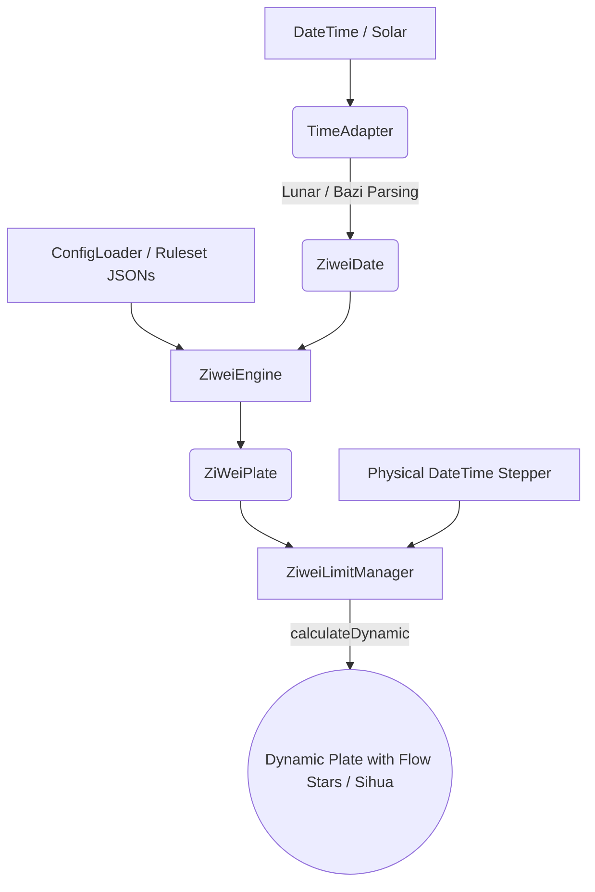

# 🔮 Ziwei Core

[](https://pub.dev/packages/ziwei_core)
[](https://pub.dev/packages/ziwei_core)
[](https://opensource.org/licenses/MIT)

Ziwei Core 是一款支持 7000 年超长时空跨度（约$-1000$ 至 $5000$）的配置驱动型紫微斗数排盘引擎。目前首发于 Dart/Flutter 生态，其核心采用了依赖注入（DI）架构，实现了算法与数据的深度解耦。支持“内存常量”与“动态 JSON”双轨加载，旨在为全平台提供一套极速、无状态、且高度可扩展的排盘算力底层。

本项目使用[bazi_core(dart)](https://github.com/RedSC1/bazi_core)计算节气四柱、获取农历时间，[sxwnl_spa_dart](https://github.com/RedSC1/sxwnl_spa_dart)计算节气、真太阳时等。排盘时间经测试可以支持公元前约1000年到公元5000年，更早以及更远的时间理论上也可以计算，但是精度无法保证，具体精度受到[sxwnl_spa_dart](https://github.com/RedSC1/sxwnl_spa_dart)的限制。

---

## ✨ 核心特性

- 🪐 **纯血 Dart 架构 (Pure Dart Architecture)**：能在 Flutter 端（iOS/Android/Web）、纯 Dart 服务端环境中光速运行，不依赖 dart:io 等平台特定库，确保在 Flutter Web 与服务端环境中拥有完美的兼容性。
- 🌌 **高精度天文底座 (High-Precision Ephemeris)**：整合天文级历法算法，自动处理真太阳时 (Apparent Solar Time) 修正、早晚子时 (Early/Late Zi) 判定、闰月分解等历法难题（可自定义流派）。确保跨越 7000 年的每一张命盘，其起盘基准都精确无误。
- ⚙️ **智能配置热补丁 (Smart JSON Patching)**：支持局部规则注入。开发者无需变动底层核心，即可通过 JSON 片段单点重载星曜逻辑或动态调整星曜集。这种设计在确保引擎纯净性的同时，为多流派的二次开发提供了极轻量的接入路径。

---

## 🚀 极速上手 (Quick Start)

### 1. 基础命盘推演（算原局）

```dart
import 'package:ziwei_core/ziwei_core.dart';

void main() async {
  // 1. 初始化引擎默认规则集 (无需读取本地文件)
  final ruleset = ConfigLoader.getDefault();

  // 2. 提供一个地球时间点（公历）与性别
  final birthday = AstroDateTime(2026, 2, 4, 19, 48);
  final ziweiDate = ZiweiDate.fromSolar(
    birthday,
    gender: Gender.male,
    options: ruleset.calendarOptions, 
  );

  // 3. 一键出盘
  final plate = ZiweiEngine.calculate(ziweiDate, ruleset);

  print('判定八字: ${ziweiDate.bazi}');
  print('命主: ${plate.mingZhu} | 身主: ${plate.shenZhu}');
  
  // 极简访问各个宫位
  final mingPalace = plate.originMingPalace;
  print("命宫位置: ${mingPalace.branch}");
  print("命宫星曜: ${mingPalace.allStars.map((s) => s.key).toList()}");
}
```

### 2. 时光机（自动算大限、流年、流日、流时）

让 `ZiweiLimitManager` 替你接管错综复杂的纪年流运图层和时辰干支推算：

```dart
// 将底盘交给状态管理器
final manager = ZiweiLimitManager(plate);

// 将时光机开往 2026年 5月 (农历), 并直接取盘
manager.setYear(2026);
manager.setMonth(5);

ZiWeiPlate monthPlate = manager.dynamicPlate;
print("今年当月的流月命宫在地支: ${monthPlate.monthMingPalace?.branch}");

// ------------------------------------------
// 📅 高阶应用：直接根据现实时间戳推算复合四层流运 (流年+流月+流日+流时)
manager.setPhysicalDate(DateTime.now());

// UI触发：用户点击了“下一时辰”
manager.nextHour(); 

// 取盘渲染，底层自动处理五鼠遁和早晚子跨日切分！
ZiWeiPlate currentPlate = manager.dynamicPlate;
```

---

## 🛠 高级功能：JSON 安星钩子 (Smart Patching)

你想单独改变某一颗星星的规则，再也不用 Fork 整个仓库，只需要这样注入一段局部 JSON：

```dart
String myCustomStarsJson = '''
[
  {
    "key": "ziwei",
    "type": "major",
    "rule": {
      "type": "lookup",
      "param": "bureau",
      "mapping": { "2": 1, "3": 2, "4": 3, "5": 4, "6": 5 }
    }
  }
]
''';

// 你只修改了紫微星的落点，底层的其他一百颗星星安然无恙！
final newRuleset = ConfigLoader.overrideWith(
  baseRuleset: ConfigLoader.getDefault(),
  starsJson: myCustomStarsJson,
);
```

> **健壮性保障**: 框架集成了极其严格的 Validation。如果你的 JSON 出现哪怕一个拼写错误 (`typ` / `rule` 缺失)，代码将瞬间报错 `FormatException: Stars JSON error: Star "ziwei" is missing the required field "type"`，帮你快速定位语法错误！

---

## 🏛 核心架构图解



## 📜 协议 (License)

Ziwei Core 采用 MIT 开源协议。如果你觉得这个强大的宇宙模拟引擎帮到了你，请给一个 ⭐ 吧！
