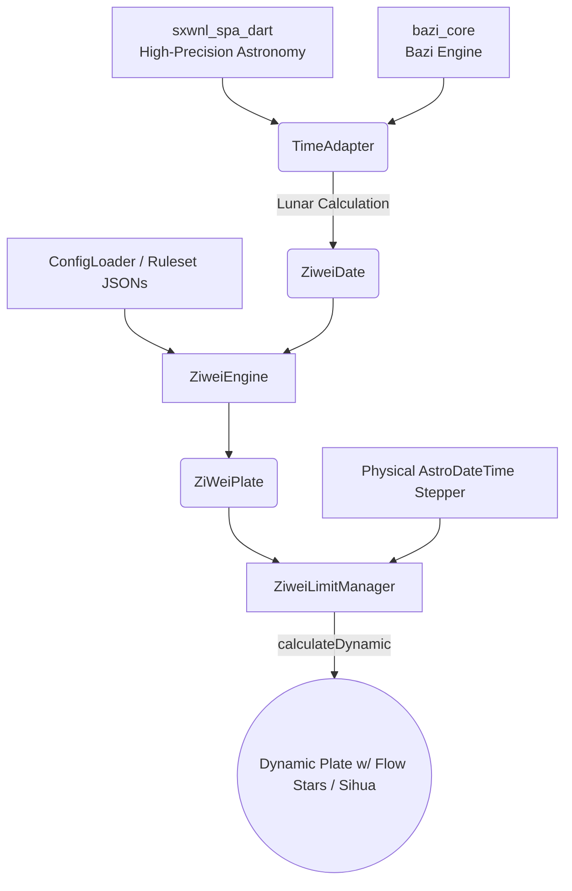

# 🔮 Ziwei Core

[中文版 (Chinese)](./README.md) | **English**

[](https://pub.dev/packages/ziwei_core)
[](https://pub.dev/packages/ziwei_core)
[](https://opensource.org/licenses/MIT)

Ziwei Core is a configuration-driven Ziwei Doushu (Purple Star Astrology) plotting engine supporting a massive 6000-year timeline (approx. 1000 BC to 5000 AD). Premiering in the Dart/Flutter ecosystem, its core utilizes a Dependency Injection (DI) architecture, achieving deep decoupling of algorithms and data. It supports dual-track mapping via "Memory Constants" and "Dynamic JSON," aiming to provide a lightning-fast, stateless, and highly extensible astrological calculation foundation for all platforms.

This project relies on [bazi_core(dart)](https://github.com/RedSC1/bazi_core) to calculate solar terms, four pillars, and fetch lunar times, and [sxwnl_spa_dart](https://github.com/RedSC1/sxwnl_spa_dart) to calculate solar terms and Apparent Solar Time. The calculation engine has been verified to support from roughly 1000 BC to 5000 AD. Earlier/later times can theoretically be calculated, but precision may vary, limited by [sxwnl_spa_dart](https://github.com/RedSC1/sxwnl_spa_dart).

The current published release targets `sxwnl_spa_dart ^0.18.4` and `bazi_core ^0.6.5`, aligning with the `LunarDate` astronomical-year, BCE ancient-calendar, and CE historical-reform year-matching fixes; if you need historical/BCE display values, use the lower-level `historicalYear` / `bceYear` helpers.

## ⚠️ Calendar Scope Warning

> The underlying lunar-calendar and solar-term algorithms in this library are based on China Standard Time (UTC+8, Beijing time) and the Chinese almanac. In regions that use a UTC+7 lunar system (e.g., Vietnam, Laos), the date boundary of synodic months can differ materially from the Chinese almanac—a new moon may fall on the 1st day of the month in Beijing but on the 30th of the previous month in Hanoi. **The default parameters are therefore not applicable to these regions.** If you need to support a non-Chinese lunar calendar, you must implement your own adapter layer (similar to `TimeAdapter`) rather than simply adjusting the `timeZone` or `location` arguments.

---

## ✨ Core Features

- 🪐 **Pure Dart Architecture**: Runs lightning fast in Flutter environments (iOS/Android/Web) and pure Dart server-side environments without relying on platform-specific libraries like `dart:io`. Guarantees perfect compatibility across all Flutter Web and server environments.
- 🌌 **High-Precision Ephemeris**: Integrates astronomical-grade calendar algorithms, automatically handling Apparent Solar Time correction, Early/Late Zi hour distinction, and leap month division (supports customized sects/branches). Ensures absolute precision across 7000 years of astrological chart generation.
- ⚙️ **Smart JSON Patching**: Supports partial rule injections. Developers can hot-patch star logic or dynamically adjust star sets via small JSON snippets without modifying the core engine. This design ensures engine purity while providing an extremely lightweight path for secondary development across different astrological schools.

---

## 🚀 Quick Start

> **💡 Complete Example Code**:
> Want to experience directly stepping through Decade limits, flowing years, and even crossing day boundaries using flowing hours in the console? Run the demo code located in the `example` directory:
> - [▶️ State Machine Managed Demo (limit_manager_demo.dart)](./example/limit_manager_demo.dart)
> - [▶️ Foundational Static Flow Demo (time_machine_demo.dart)](./example/time_machine_demo.dart)

### 1. Basic Chart Calculation (Origin Chart)

For a detailed explanation of `ZiweiDate` construction, refer to [Core API Exhibition: ZiweiDate](./doc_en/06_ziwei_date.md).

```dart
import 'package:ziwei_core/ziwei_core.dart';

void main() async {
  // 1. Initialize the engine's default ruleset (No local file reading required)
  final ruleset = ConfigLoader.getDefault();

  // 2. Provide a Gregorian chronological time and gender
  final birthday = AstroDateTime(2026, 2, 4, 19, 48);
  final ziweiDate = ZiweiDate.fromSolar( // Creates Ziwei Date using Gregorian time
    birthday,
    gender: Gender.male,
    options: ruleset.calendarOptions, 
  );

  // 3. Generate Chart with One Line (defaults to Heaven Plate)
  final plate = ZiweiEngine.calculate(ziweiDate, ruleset);

  print('BaZi (Four Pillars): ${ziweiDate.bazi}');
  print('Ming Zhu: ${plate.mingZhu} | Shen Zhu: ${plate.shenZhu}');

  // Minimalist access to Palaces
  final mingPalace = plate.originMingPalace;
  print("Ming Palace Branch: ${mingPalace.branch}");
  print("Ming Palace Stars: ${mingPalace.allStars.map((s) => s.key).toList()}");
}
```

### 2. Heaven / Earth / Human Plates (天盘 / 地盘 / 人盘)

Switch plate mode via the optional `tdrPan` parameter (defaults to Heaven Plate):

```dart
// Heaven Plate (default, can be omitted)
final tianPlate = ZiweiEngine.calculate(date, ruleset);

// Earth Plate: uses Body Palace as Ming Palace
final diPlate = ZiweiEngine.calculate(date, ruleset, tdrPan: TDRpan.diPan);

// Human Plate: uses Fude Palace (Ming + 2) as Ming Palace
final renPlate = ZiweiEngine.calculate(date, ruleset, tdrPan: TDRpan.renPan);
```

> Changing the Ming Palace position affects the Five Element Bureau calculation, so the three plates may have different bureaus and star distributions.
> See [▶️ TDR Pan Demo (tdr_pan_demo.dart)](./example/tdr_pan_demo.dart) for a complete example.

### 3. Time Machine (Decade, Year, Month, Day, Hour Flows)

Use [`ZiweiLimitManager`](./example/limit_manager_demo.dart) to manage dynamic plates (Decade, Year, Month, Day, and Hour rules):

```dart
// Give the base plate to the state manager
final manager = ZiweiLimitManager(plate);

// Fast-forward to May 2026 (Lunar) and extract the plate directly
manager.setYear(2026);
manager.setMonth(5);

ZiWeiPlate monthPlate = manager.dynamicPlate;
print("This month's Ming Palace Branch: ${monthPlate.monthMingPalace?.branch}");

// ------------------------------------------
// 📅 Derive multi-layered flows based directly on physical timestamps
manager.setPhysicalDate(DateTime.now());

// UI Event: User clicks "Next Hour"
manager.nextHour(); 

// Render the plate, the underlying engine handles the "Five Rats Finding Hours" and cross-midnight splitting automatically
ZiWeiPlate currentPlate = manager.dynamicPlate;
```

---

## 🛠 Advanced Features: Smart Patching via JSON

You can alter a specific star's rule by injecting a partial JSON snippet (for details refer to [Configuration Override and Sect Customization](./doc_en/02_custom_rulesets.md) and [JSON Constants Enum Reference](./doc_en/07_json_value_reference.md)):

```dart
String myCustomStarsJson = '''
[
  {
    "key": "ziwei",
    "type": "major",
    "rule": {
      "type": "lookup",
      "anchor": "bureau",
      "table": { "2": 1, "3": 2, "4": 3, "5": 4, "6": 5 }
    }
  }
]
''';

// The position rule of Ziwei is modified, while the other ~100 stars remain completely untouched!
final newRuleset = ConfigLoader.overrideWith(
  baseRuleset: ConfigLoader.getDefault(),
  starsJson: myCustomStarsJson,
);
```

### Modifying Calendar Rules (main_rules.json)

Beyond stars, you can inject `mainRulesJson` to override the lowest-level runtime mechanisms on the fly, such as turning Early/Late Zi hour distinction on or off, or shifting the bounds of SiHua triggers (detailed in [Default Configuration file `default.json`](./doc_en/03_config_file.md)):

```dart
String myCalendarConfig = '''
{
  "calendar": {
    "rat_hour_mode": "noSplit", // Hot Reload: forcefully change the rat hour splitting mode
    "leap_month_strategy": "split_by_15th" // Change Leap Month ruleset
  }
}
''';

final customCalendarRuleset = ConfigLoader.overrideWith(
  baseRuleset: ConfigLoader.getDefault(),
  mainRulesJson: myCalendarConfig, 
);
```
---

## 🏛 Core Architecture Diagram



## ⚖️ Developer Notes

Given the numerous sects of Ziwei Doushu, distinct ancient texts, and limited personal capacity, please note:

- **Algorithm Verification**: The algorithm for star brightness (Miao/Wang/Li/Xian) and placements of minor auxiliary stars heavily relies on mainstream astrological sites and AI-assisted cross-validation. Not all ancient texts have been exhaustively cross-referenced frame by frame.
- **Test Coverage**: While automated unit test suites are available, the millions of combination states limit our guarantee over edge cases across deep astronomical shifts.
- **Reporting Issues**: If generated charts deviate from expectations or you have enhancement suggestions, please file an Issue. Every metric of feedback makes Ziwei Core structurally stronger.

## 🚀 Roadmap

- [x] **API & Architecture Documentation**: Successfully rewritten, refer to the [Core API Reference](./doc_en/04_api_reference.md) for architectural and API details.
- [x] **Heaven/Earth/Human Plate Support**: Switch between Heaven (天盘), Earth (地盘, Body Palace as Ming), and Human (人盘, Fude Palace as Ming) plates via the `TDRpan` parameter.
- [ ] **Sect Deep Support**: Implement Zhongzhou, Flying Star, and other major sects' calculation algorithms.
- [ ] **Sect Configuration Presets**: Package more mainstream sect SiHua and brightness rulesets by default.
- [ ] **Translation & i18n**: Expand language tags and JSON dictionaries for complete internationalization.
- [ ] **Test Expansions**: Incorporate deep edge-case matrices to test algorithm resilience.

## ⚠️ Disclaimer

This library is intended for astronomical research and calculation studies. The author is not legally responsible for any predictions, decisions, or actions taken based on this library's output. Please treat astrological logic rationally, respect science, and remember your life is in your own hands.

## 📜 License

Ziwei Core is available under the MIT open source license. If this tool helped you, please consider leaving a ⭐!
